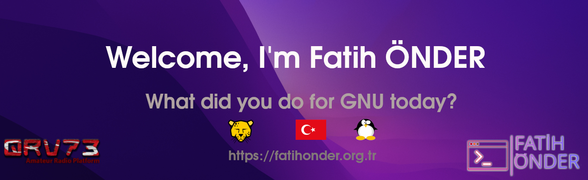

👋 Welcome to my GitHub profile! I am a Software Developer with a passion for constant learning and discovery.

## 💌 Contact Me

 
 

---

## 🌍 Languages and Tools I Know and Use

 

 

 

 
 

 

 
 

 

 
 
 
 

 

 

 

 

 
 
 
 
 
 

 

# 

---

## 💿 Operating Systems We Use and Support

---

# 📊 GitHub Stats:
 
 

## 🏆 GitHub Trophies

### ✍️ Random Dev Quote

### 🔝 Top Contributed Repo

---

## ⚡ Interests:
-Software Development: I enjoy diving into the world of software development, constantly expanding my knowledge and skills in areas such as PHP, SQL, Python, Docker, JavaScript, HTML, CSS, VB.net, C# and Shell Script.

-Operating systems: The GNU Linux Debian Based PARDUS Operating System I Use Very Often. For VB.Net I Sometimes Use Microsoft Windows. I'm a Professional User on Both Linux and Windows

-Ham Radio: As a licensed ham radio operator with the call sign TB1TFO, I love connecting with radio enthusiasts and exploring the world of ham radio communications. I believe in the power of collaboration and open source communities, and GitHub is an incredible platform that allows me to learn from others and contribute to exciting projects.
Let's connect, collaborate and do amazing things!

I am also Owner and Administrator of Online Radio Amateurs Platform www.QRV73.com

---
